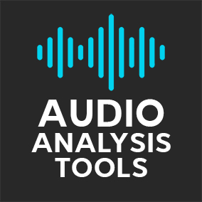

# Audio Analysis Tools
Audio Analysis Tools plugin for Unreal Engine. Supports Envelope Analysis and Onset (Beat) detection.
Works in conjunction with the Runtime Audio Importer plugin.
Plugin does not require any static libraries and external dependencies.

## Features
- Envelope Analysis
- Onset (Beat) Detection
- No any static libraries and external dependencies
- Support for all available devices (Android, iOS, Windows, Mac, Linux, etc)

## Documentation
Click on the following link to view the documentation - https://unreal.blog/audio-analysis-tools

## Legal info

Unreal® is a trademark or registered trademark of Epic Games, Inc. in the United States of America and elsewhere.

Unreal® Engine, Copyright 1998 – 2021, Epic Games, Inc. All rights reserved.
